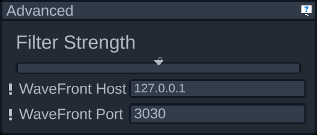

# Advanced panel

This panel includes advanced settings that don't belong in other panels.

The filter strength affects how strong of a low pass filter to apply to data as its rendered on the model, where the slider being all the way to the left indicates no filter should be applied. A low pass filter prevents spikes in data from having as much of an affect, effectively "smoothing" out the data. This isn't ideal for data analysis, however, so the data written to file will NOT be affected by this setting. This only affects how it appears on the model.

The next two values are for setting up the WaveFront data source. The default values are written according to specification and these will probably not needed to be changed. If they do, however, it'll be because of the hardware/network setup on the machine the program is running on. Because of that, these properties are stored independently from profiles. Because of that, they have a warning that these will affect all profiles. 
