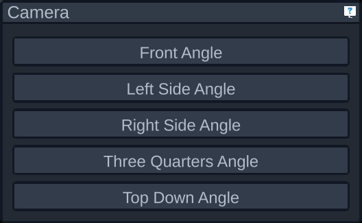

# Camera Panel

The camera panel shows a list of recommended camera positions and angles.

If you'd like a custom camera angle, you can hold the right mouse button down and move it to change the direction of the camera. While looking around you can also use the WASD keys on your keyboard to move the camera forward, backward, left, and right; and Q and E to move the camera up and down. Hold down shift while moving to move faster.
