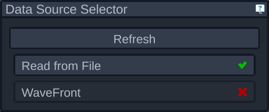

# Data Source Selector

The data sources selector panel allows you to select from which source the sensors will pull data from. Each source may be enabled or disabled depending on the hardware currently connected to the machine. In some cases it may take some time to determine if the hardware is available, in which case you'll see the following icon while its working:

## Additional Info on Each Data Source

- [File Data Source](./file.md)
- [WaveFront Data Source](./wavefront.md)
