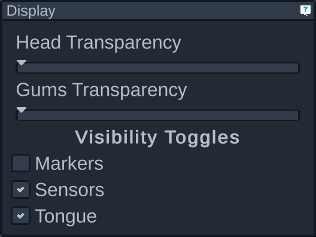

# Display panel

This panel allows you to configure how the tongue and avatar appear.

The head transparency slider affects how visible versus see-through the avatar appears. All the way to the right means completely visible.

The gums transparency slider works the same way but for the avatar's gums.

Underneath the transparency sliders are visibility toggles. These allow you to choose whether or not certain markers appear:

- Markers refer to the reference sensors like the forehead, ears, and jaw
- Sensors refer to all the sensors on the tongue
- Toggling the tongue visibility affects the appearance of the tongue model itself
