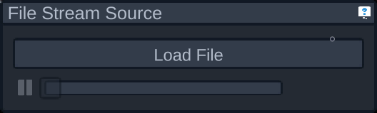
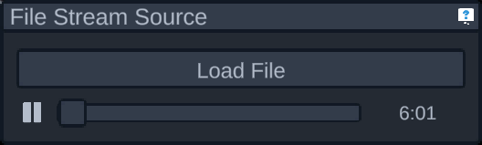

# File Data Source

This data source loads sweep data from a file and plays it back. The file can be either a WaveFront sweep file or an OptiSpeech sweep file (including the OptiSpeech 1, and including both raw and transformed data from OptiSpeech 2).

To select the sweep data to load, press the "Load File" button in the panel that appears and select a file from the file browser. The file will then be loaded, which may take a little while. Once its complete the UI elements below the Load File button will be interactable. If they aren't, there was an issue loading the file you selected. Here's what the panel looks like when a file is successfully loaded:

Below the Load File button are three UI elements. The first is a button to pause or resume playback of the loaded file. Next is a progress bar showing how far along the file the playback is. You can move the progress bar to go forward and backwards through the file. Finally, when there's a file loaded, the duration of the sweep will appear on the right side of the progress bar.
