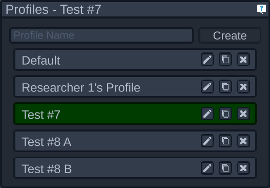

# Profile Selector

All the settings from where the camera is, to sweep settings, are saved in "profiles". In the profile selector you can add new profiles, delete old ones, and switch between them at will. There are two main reasons for having different profiles:

- Different experiments may require different setups, and this allows you to switch between them as needed
- A single experiment may require testing under different conditions, and storing those conditions as profiles makes it easy to switch between them

To create a new profile, type the name in the text field at the top of the panel and click "Create". This will create a new profile with the default settings.

Clicking a profile (but not on one of the three buttons) will select that profile. The currently selected profile will be highlighted in green. Additionally, the name of the panel will include the name of the active profile.

The three buttons have the following purposes:

- The first button toggles rename mode. When in rename mode, you can type the new name of the profile and either press enter or the rename button again (which will now appear as a checkmark) to save the name. To cancel, press escape or click off the textfield.
- The second button will duplicate that profile
- The third button deletes that profile. Careful, there's no way to undo this besides recreating that profile from scratch!

Please be considerate of other researches and don't write over their profiles! You can always duplicate their profile first if you like their settings.
