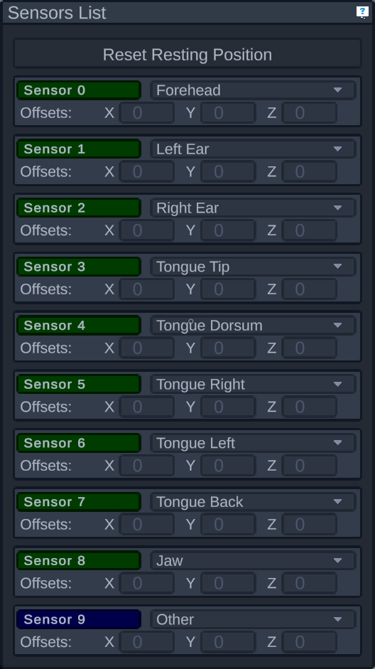

# Sensors List

When a data source is active, this panel shows a list of all the current sensors and their statuses. The sensors status is shown via a colored background behind the sensor ID, and comes from the data source so the user cannot add or remove sensors or change their status.

Each sensor can one of the following statuses:

- OK - green, everything's okay
- BAD FIT - red, a status WaveFront may send under certain conditions
- OUT OF RANGE - yellow, the sensor is outside of the detectable area
- PROCESSING ERROR - blue, something went wrong processing the data for this sensor
- UNKNOWN - black, when the status cannot be determined

In addition to the sensor status, the user can change each sensor's settings. This includes which position each sensor is in, by using the dropdown. You can also add an offset to each non-reference sensor, which will move where that sensor appears on the avatar by a set distance in each of the three axes. You can drag the label for each axis to change the value and see how it affects the sensor on the model. This is useful for situations where you couldn't place the sensor exactly where it needed to be, for example if a gag reflex prevented placing a sensor as far back in the mouth as it needed to be.

Finally, above the sensors is a button to reset the resting position. The jaw uses a resting position to determine when its open or closed. If the jaw or tongue ever appears to be out of alignment, ask the patient to rest their face - that is, have it closed and not be conciously using any muscles. Then clicking this button will make the jaw appear closed at this position. The initial resting position is wherever the sensors were when the current data source was selected.

> [!NOTE]
> Some data sources prevent affecting the sensors' settings, such as the file data source, in which case everything in the sensors list is "read-only", and can't be edited.
