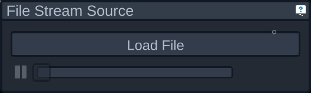

# Getting Started

This guide is intended to bring a researcher with no experience using OptiSpeech 2 to a point where they can use the software and most of its features comfortably. For more detailed explanations on specific parts of the tool, please use the links in the sidebar. 

When you first open up OptiSpeech, you will see a large message that there is no data source selected. On the left you'll see a number of panels, including an open one with a list of data sources you can choose from. Some may be disabled if the system doesn't currently support that data source, in which case they'll have a red X on the side. If you're playing back a previously recorded sweep, you'll want to choose the "Read from File" data source. Otherwise choose whichever source corresponds to the hardware you plan on using. 

If you choose the "Read from File" data source, you'll have to select the file to read from by clicking the "Load File" button in the new set of panels on the right side of the screen.

The tongue model should now be moving to visualize the data being read in from the data source you've selected.

If you need a different camera angle you can hold down the right mouse button and use the WASD keys to move the camera. Moving your mouse while holding down the right mouse button will also change the direction the camera is pointing in. 

When you're ready to start recording data, you're going to use the "Sweeps" panel. You can choose a folder to put the data into, such as a flash drive or a folder specific to your research. You can then write a sweep name. When starting a sweep it'll automatically append an incrementing number if there's already a sweep with that name. You can then click Start Sweep to begin recording data, and the button will then turn into a Stop Sweep button that will end the recording. By default it'll record the raw data for playback in OptiSpeech 2 as well as a file with all the sensor data after its been "transformed", which means after its been placed onto the tongue model. This is a .tsv file, and when you're performing your data analysis this is probably the file you want. By default an audio file is also saved which contains anything recorded from the microphone during the sweep. There are checkboxes to enable or disabled which files you'd like to be written. 

That's enough to get you started! You now know how to collect data using OptiSpeech 2. For more advanced usage you can explore the other panels to find out what they do, or use the sidebar to read the documtation on each of them. Each panel also has a convenient help button that'll open its documentation page in your browser. 
