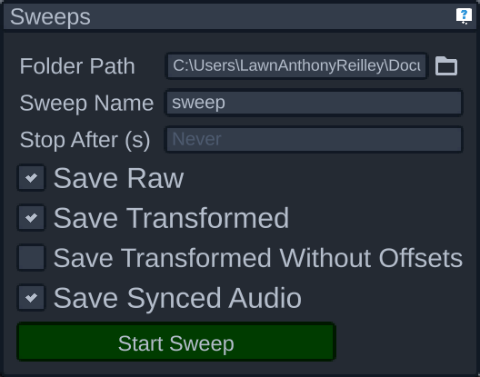

# Sweeps Panel

The sweeps panel is where you can configure and then start and stop sweeps. The first two fields allow you to specify where to save your sweep data, and what to call it. If there's already a sweep with that same name, it'll automatically increment a number to make a unique sweep name (e.g. sweep 2, then sweep 3, etc.)

The stop after field allows you to configure a time to automatically stop the sweep. If left blank the sweep will not stop until you manually tell it to. If you have given this a value, you can still manually stop the sweep before the duration has passed.

The 4 toggles allow you to configure what data gets saved in each sweep:

- Raw will save a tab-separated values (tsv) file with all the sensor data completely unprocessed, as well as contain information on what data source was used, the name of the audio file if any, and how each sensor and target was configured. This can be read back by OptiSpeech 2 to have the exact same sensors, targets, and sensor data as when the sweep was recorded, making this the recommended format for future playback
- Transformed will save a tab-separated values (tsv) file with all the sensor data after its been transformed to fit onto the head. This will normalize any head movement and positioning, allowing for data from different sweeps to be more congruent. This format loses any sensor or target information, so its recommended to use this solely for data analysis
- Transformed without offsets will save a file exactly like the one above, but without any configured sensor offsets. In most common cases there won't be any configured sensor offsets, so this format is rarely useful
- Audio will save any audio coming from the default microphone if any. This will also be played back when the raw or transformed data is being played back

By default, all but the transformed without offsets format will be selected, which is the recommended setup for most cases.
