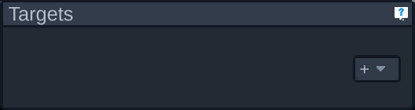
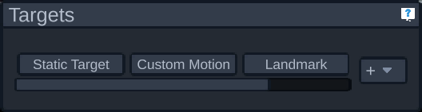
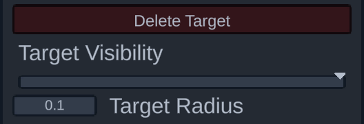
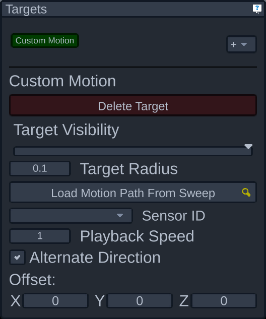
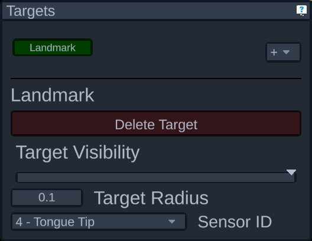
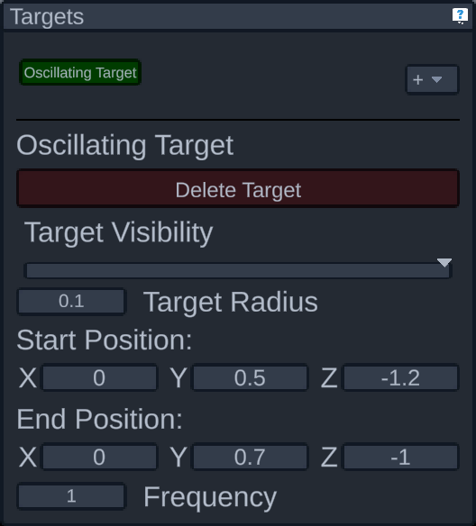
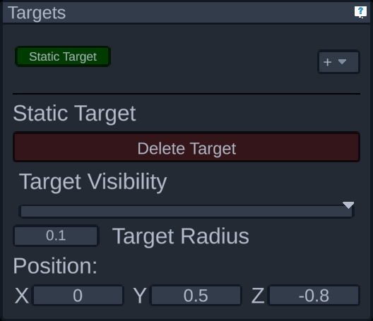

# Targets Panel

The targets panel shows the current targets and allows them to be added, removed, and configured. Initially it'll appear empty as shown above, and they can be added using the dropdown.

The dropdown allows you to specify the type of target to add:

- Custom Motion: Follows the position of a sensor from an old sweep 
- Landmark: Follows the position from one of the current sensors
- Oscillating Target: Moves back and forth between two points
- Static Target: Stays in one place

Added targets will appear to the left of the add target button, with a scrollbar if necessary, like so:

Clicking on a target will allow you to delete or configure that target. The fields shown will vary depending on the target type. Some fields, however, will appear on all target types: 

- The delete target button will remove this target
- The target visibility slider affects the transparency of the target, where all the way to the right is completely opague
- The target radius affects the size of the target marker, and how accuracy is calculated (see the [accuracy panel](./accuracy.md) for details)

Each type of target then has additional settings:

**Custom Motion:**

- The custom motion config shows a button to load a previously saved sweep to get motion path data from. When waiting to select a sweep it will show a magnifying glass. If a file is chosen but it fails to find any sweep data, that'll change to a red cross. If it succeeds, a green checkmark will appear. 
- Once a motion path is successfully loaded, the Sensor ID dropdown can be used to select which sensor from the motion path the target should follow.
- Playback speed will affect the rate at which the sweep's data will play.
- Alternate direction will make the motion path play back in reverse after playing back forward, and flip-flopping. This prevents the data from "jumping" when the sweep ends and resets.
- Offset will change the position of the sweep data by the specified three axis values.

**Landmark:**

- The sensor ID is the ID of one of the active sensors that this target should follow

**Oscillating Target:**

- The start and end positions are 3D points that the target will move between, back and forth. Dragging each X, Y, and Z label will allow you to change the number as if it were a slider.
- Frequency is how many times the target will make a full "cycle" per second, where one cycle is the travel from the start position, to the end position, and back to the start position.

**Static Target:**

- The position is a 3D point where this target should be
